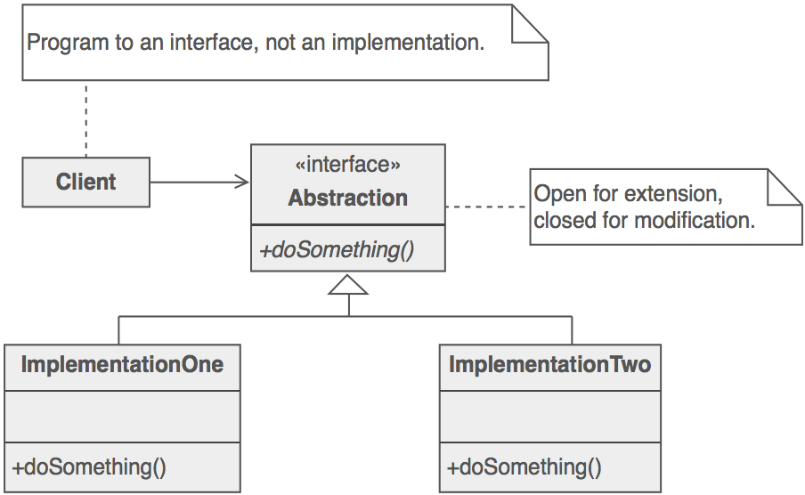
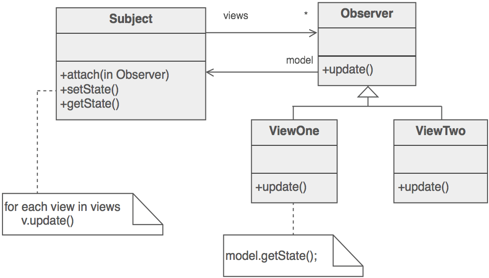
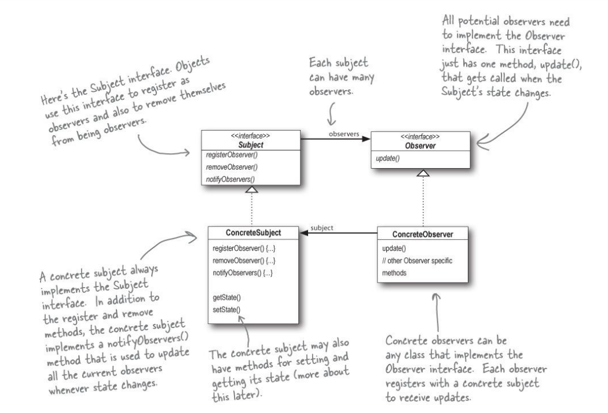

# Strategy
## Intent 
Define a family of algorithms, encapsulate each one, and make them interchangeable. Strategy lets the algorithm vary independently from the clients that use it.
## Description
The strategy pattern is behavioural design pattern and the idea is that you choose a suitable strategy based on user input 
the strategy pattern (also known as the policy pattern) is a behavioral software design pattern that enables selecting an algorithm at runtime. Instead of implementing a single algorithm directly, code receives run-time instructions as to which in a family of algorithms to use 
select an implementation at runtime based on the user input without having to extend the class. 
Whenever we find an interface that will allow us to change some behavior, We can inject our own implementation and make sure that we provide the strategy for how to solve that particular problem.
## Example
For example if think of a logger. A logger can log messages in many different ways. In database, in flat file and in any other service like otlp, Jaeger and many more. We can choose which service(Strategy) on runtime based on configurataion. 
Another example is to store files in application. We can implement different ways of storing a file in application. Like storing in database, on the application server, on shared folder, on ftp server, azure storage, aws s3. Depending on requirements we can configure/choose desired strategy to store file.
## Links
- https://en.wikipedia.org/wiki/Strategy_pattern
- https://www.informit.com/articles/article.aspx?p=1398602&seqNum=4
- https://refactoring.guru/design-patterns/strategy
## UML
<!---

-->

## Sample Code 
This code demonstrates the Strategy pattern which encapsulates sorting algorithms. This allows clients to dynamically change sorting students by Name and Age. 
[Streatgy Pattern Sample Code](./CodeSamples/DesignPatterns/streatgy.cs)

  

# Command
## Intent
The Command pattern is a behavioral design pattern that we can use to turn a request into an object which contains all the information about the request 
This transformation lets you pass requests as a method arguments, delay or queue a request's execution, and support undoable operations.
## Description
When we want to delay or queue a request's execution or when we want to keep track of our operations. Then we use this pattern. Furthermore, this possibility to keep track of our operations gives us the opportunity to undo them as well. 
There are four terms in Command Design Pattern **Client**, **Invoker**, **Receiver** and **Command**. 
- A command object knows about the receiver and invokes a method of reciver. 
- An invoker knows how to execute a command and optionally does bookkeeping of commands executed.
- Client Object contains the Command Object, Reciver Object and Invoker Object
- Receiver is the object which will execute the instruction command carry.
  
The client decides which receiver objects it assigns to the command objects, and which commands it assigns to the invoker. 
The client decides which commands to execute at which points. To execute a command, it passes the command object to the invoker object.
 
Command calls actual method of the receiver(target object). Invoker excutes command object. Client creates Receiver, Command objects and then creates Invoker Object and Schedules command in it. 

## Example

## Links
- 'https://docs.microsoft.com/en-us/archive/msdn-magazine/2004/september/distributed-system-design-using-command-pattern-msmq-and-net'
- 'https://code-maze.com/command/'
- 'https://refactoring.guru/design-patterns/command/csharp/example'
- 'https://betterprogramming.pub/the-command-design-pattern-2313909122b5'

## UML

## Sample Code
[Streatgy Pattern Sample Code](./CodeSamples/DesignPatterns/Command.cs)

  

# Bridge Pattern
## Intent
Bridge is a structural design pattern that lets you split a large class or a set of closely related classes into two separate hierarchies abstraction and implementation�which can be developed independently of each other.

## Description
When a large class is changing very often then split it into more than one class and encapsulate related members together. Then create/pass object of one in another to bridge the gap which is created by splitting the classes.  
The definition is a bit dirrerent but actual implementation may look similar to the Strategy Pattern. 

## Example
Think about a Window Application which can run on many Operating systems. You can code everything one class and use if-else to execute os native function. Or you can create one UI class and many os reated functiolity classes. Then pass the desired native implementation to the UI class to brigde the gap. 

## Links
- 'https://refactoring.guru/design-patterns/bridge'
- 'https://www.geeksforgeeks.org/bridge-design-pattern/'
- 'https://exceptionnotfound.net/bridge-pattern-in-csharp/'

## UML

## Sample Code
<i> In progress </i>

  

# Observer
## Intent
- Define a one-to-many dependency between objects so that when one object changes state, all its dependents are notified and updated automatically.
- Encapsulate the core (or common or engine) components in a Subject abstraction, and the variable (or optional or user interface) components in an Observer hierarchy.

## Points To Remember
- The Observer Pattern defines a one-to-many relationship between objects.

- Subjects, or as we also know them, Observables, update Observers using a common interface.

- Observers are loosely coupled in that the Observable knows nothing about them, other than that they implement the Observer interface.

- You can push or pull data from the Observable when using the pattern (pull is considered more “correct”).

- Don’t depend on a specific order of notification for your Observers.

- In .NET, the observer design pattern is applied by implementing the generic **System.IObservable<T>** and **System.IObserver<T>** interfaces. The generic type parameter represents the type that provides notification information.

## Description
When a set of objects depend on state of another object and want to act as soon as that object's state changes, they subscribe for updateds in that object. Now whenever that object changes its state it just send notification to its subscribers. 

## Example
Imagin the stock prices. Stock pricess are continuously go up and down. And when it happens, the client application (Traders App) calculates the profit, loss and many more parameters. So here client application is observing the stock market. As soon as prices gets changed it sends notification to the services so that they can calculate different kinds of retios. Alos update the chart and UI. 

## Links
- https://learn.microsoft.com/en-us/dotnet/standard/events/observer-design-pattern
- https://www.dofactory.com/net/observer-design-pattern
- https://sourcemaking.com/design_patterns/observer

## UML

 
 

## Sample Code
[Streatgy Pattern Sample Code](./CodeSamples/DesignPatterns/Observer.cs)

  

# Decorator
## Intent
The Decorator Pattern attaches additional responsibilities to an object dynamically. Decorators provide a flexible alternative to subclassing for extending functionality

## Points to remember
- Inheritance is one form of extension, but not necessarily the best way to achieve flexibility in our designs.
- In our designs we should allow behavior to be extended without the need to modify existing code.
- Composition and delegation can often be used to add new behaviors at runtime.
- The Decorator Pattern provides an alternative to subclassing for extending behavior.
- The Decorator Pattern involves a set of decorator classes that are used to wrap concrete components.
- Decorator classes mirror the type of the components they decorate. (In fact, they are the same type as the components they decorate, either through inheritance or interface implementation.)
- Decorators change the behavior of their components by adding new functionality before and/or after (or even in place of) method calls to the component.
- You can wrap a component with any number of decorators.
- Decorators are typically transparent to the client of the component; that is, unless the client is relying on the component’s concrete type.
- Decorators can result in many small objects in our design, and overuse can be complex.

## Desription
We can implement decorator by having a member of its own type and then extend (add more functionality on top of containing obects method) the operation of containing object.

## Example
Think about a mathematical equation/expression. The expression will always retun a number. You can pass that expression into another expression and apply some more operation on top of the existing expressions.
Another example is filters on an image. First there will be an original image. Then you apply a filter on that image and it will still remain an image. In the same way you can apply many more filters on top of another filters. So decorator patters works in same way.

## Links
- https://sourcemaking.com/design_patterns/decorator
- dofactory.com/net/decorator-design-pattern

## UML

## Sample Code
[Decorator Pattern Sample Code](./CodeSamples/DesignPatterns/Decorator.cs)

  

# Factory Method
## Intent
Define an interface for creating an object, but let subclasses decide which class to instantiate. Factory Method lets a class defer instantiation to subclasses 
Factory Method is a creational design pattern that provides an interface for creating objects in a superclass, but allows subclasses to alter the type of objects that will be created.

## Points to Remember
- All factories encapsulate object creation.
- Simple Factory, while not a bona fide design pattern, is a simple way to decouple your clients from concrete classes.
- Factory Method relies on inheritance: object creation is delegated to subclasses, which implement the factory method to create objects.
- Abstract Factory relies on object composition: object creation is implemented in methods exposed in the factory interface.
- All factory patterns promote loose coupling by reducing the dependency of your application on concrete classes.
- The intent of Factory Method is to allow a class to defer instantiation to its subclasses.
- The intent of Abstract Factory is to create families of related objects without having to depend on their concrete classes.
- The Dependency Inversion Principle guides us to avoid dependencies on concrete types and to strive for abstractions.
- Factories are a powerful technique for coding to abstractions, not concrete classes.

## Description
Define an abstract method in parent class so that child class can create new objects as per need. That method is called Factory Method. And this pattern is called Factory Method Pattern.  

## Links
- https://sourcemaking.com/design_patterns/factory_method
- https://www.dofactory.com/net/factory-method-design-pattern
  
## UML

## Sample Code
[Factory Method Pattern Sample Code](./CodeSamples/DesignPatterns/FactoryMethod.cs)

  
